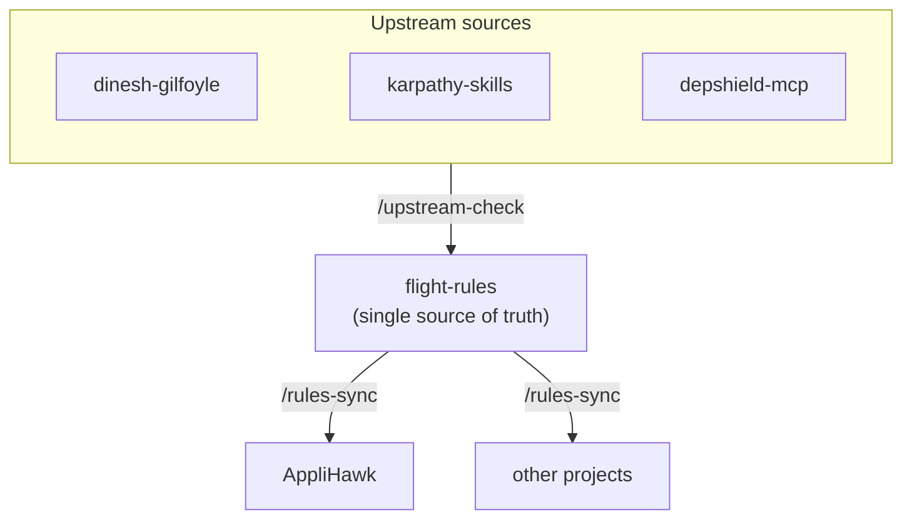

# flight-rules

[](.claude-plugin/plugin.json)
[](LICENSE)

Generic, project-agnostic engineering rules and AI workflows, distilled from real
projects (first: [AppliHawk](https://applihawk.com)). One source of truth — projects
consume this repo instead of maintaining drifting copies.

The name is borrowed from NASA's *flight rules* — the accumulated, written-down
procedures for every situation a mission has already encountered, so nobody improvises
a known problem twice.

Everything here is **plain Markdown and tool-agnostic**: the same files work with
Claude Code, Cursor, Codex, Copilot, Antigravity, or any assistant that reads Markdown
context. A thin Claude Code plugin wrapper is included so Claude installs the skills
natively.

## How it flows

One hub, two directions. Improvements from the sources this playbook adapts flow **in**
(reviewed via `/upstream-check`); the playbook flows **out** to every project (pulled and
reconciled via `/rules-sync`) — so nobody maintains a drifting copy.



## Layout

```
rules/     Always-on principles a project's CLAUDE.md / .cursorrules should point at
skills/    Invocable workflows — see the catalog below
hooks/     Enforcement templates — git merge-gate hooks + agent commit/secret guards
.claude-plugin/   Claude Code marketplace + plugin manifests
UPSTREAMS.md      Sources this playbook adapts from + last-synced refs (see /upstream-check)
```

The skills say what the workflow is; the hooks make it non-optional. `hooks/git/`
blocks merges into protected branches without a stamped passing pre-merge check, and
`hooks/agent/` stops the assistant from committing on a protected branch or with
secrets staged. They are copy-into-project templates (each project sets its own
branch names) — see `hooks/README.md`.

## Rules

Always-on principles a project's rules entry point points at.

| Rule | Governs |
|---|---|
| [`engineering-principles`](rules/engineering-principles.md) | How to approach a change — scope discipline, verify before claiming done, suggest better ways, judge ideas on merit not authorship |
| [`git-worktree-workflow`](rules/git-worktree-workflow.md) | One change per branch via worktrees; never commit to a protected branch |
| [`dependency-lockfile`](rules/dependency-lockfile.md) | Intent-file + lockfile pinning, deliberate upgrades, and agent-aware pre-install checks |
| [`multi-ai-setup`](rules/multi-ai-setup.md) | Conventions for running more than one AI assistant in a repo |

## Skills

Invocable workflows. In Claude Code they're slash commands; in any other tool they read as plain Markdown procedures.

| Skill | Does | Reach for it when |
|---|---|---|
| [`/dg`](skills/dg/SKILL.md) | Adversarial review — one persona defends, one tears it apart | Pressure-testing code, a design, or a decision |
| [`/diagnose`](skills/diagnose/SKILL.md) | Structured debugging — reproduce, minimise, fix, verify | A bug you can't one-shot |
| [`/feature-start`](skills/feature-start/SKILL.md) | Open a new branch as an isolated git worktree | Starting any unit of work |
| [`/pre-merge-check`](skills/pre-merge-check/SKILL.md) | Automated pre-merge checklist; stamps a git note the merge-gate verifies | Before merging a branch |
| [`/pr-create`](skills/pr-create/SKILL.md) | Push the branch and open a GitHub PR with the checklist in the body | Ready to raise a PR |
| [`/commit`](skills/commit/SKILL.md) | Guarded commit — protected-branch, secret-scan, and test-coverage checks | Every commit |
| [`/docs-lint`](skills/docs-lint/SKILL.md) | Health-check living docs for drift, contradictions, and stale claims | Docs start to rot |
| [`/rules-sync`](skills/rules-sync/SKILL.md) | Pull the latest playbook and reconcile a project's local copies | After the playbook updates |
| [`/upstream-check`](skills/upstream-check/SKILL.md) | Check the sources this playbook adapts from for changes to fold in | Maintaining flight-rules itself |

## Consuming from a project

**Claude Code (skills, native):**
```
/plugin marketplace add mkb3nigma/flight-rules     # or the local clone path
/plugin install flight-rules@flight-rules
```

**Any AI tool (rules, by pointer):** add one line to the project's rules entry point
(CLAUDE.md, .cursorrules, `.ai/master-rules.md`, …):

> Generic engineering rules: read `~/Projects/flight-rules/rules/` (or the repo URL).
> Project rules extend and override them.

**Or just point your assistant at it.** No clone, plugin, or marketplace required — give
your assistant the repo link and ask it to incorporate the rules, or point your project's
rules file at the URL. The Claude Code plugin is a convenience wrapper, not a dependency;
a native plugin for other assistants (Cursor, Copilot, Antigravity, …) can follow if there's demand.
However you adopt it, keep the attribution — the MIT licence simply asks that the
copyright and licence notice travel with the content ([LICENSE](LICENSE),
[ATTRIBUTIONS.md](ATTRIBUTIONS.md)).

## Project-specific extensions

Never edit these files with project details. A project that needs to extend a skill
keeps a local copy with a clearly marked `## <Project> Extensions` section at the
bottom (see the sync note pattern inside `skills/dg/SKILL.md`), or overrides a rule in
its own rules file. **Generic changes flow here; project flavor stays in the project.**

## Parameters

Skills refer to placeholders rather than hardcoding a project's setup:

| Placeholder | Meaning | AppliHawk example |
|---|---|---|
| `{PROTECTED_BRANCHES}` | branches that never take direct commits | `main`, `staging`, `dev` |
| `{INTEGRATION_BRANCH}` | where feature branches merge | `dev` |
| `{WORKTREE_DIR}` | where feature worktrees live | `.ai/worktrees/` |
| `{TEST_COMMANDS}` | the project's suites | `pytest` / `npm run test:run` |

A project defines these once in its own rules file; skills read them from there.

## Design notes

- **Tool-agnostic by default.** Plain Markdown, so the same rules work in Claude Code,
  Cursor, Codex, or Copilot — no lock-in to one assistant.
- **Enforcement, not etiquette.** The workflows ship with git hooks that *block* the
  mistake — merging without a passing check, committing on a protected branch or with
  secrets staged — instead of trusting everyone to remember. This repo runs those hooks
  on itself (`.ai/hooks/`): the rules repo obeys its own rules.
- **One source of truth.** Projects consume the playbook and reconcile with `/rules-sync`
  rather than copy-pasting rules that silently drift apart.
- **Provenance as a system.** Each adaptation is pinned to an upstream ref and re-checked
  with `/upstream-check`, so credited work stays current and honestly attributed.

## Credits & license

MIT for original content (see `LICENSE`). Several pieces adapt other people's work and
carry their upstream licenses — notably the `dg` skill (from
[v1r3n/dinesh-gilfoyle](https://github.com/v1r3n/dinesh-gilfoyle), Apache-2.0) and the
engineering principles (from
[multica-ai/andrej-karpathy-skills](https://github.com/multica-ai/andrej-karpathy-skills),
MIT, after Andrej Karpathy's observations).

Provenance is tracked as a system, not a footnote: every adaptation is credited with its
modifications in [ATTRIBUTIONS.md](ATTRIBUTIONS.md), and each source's last-reviewed ref
is pinned in [UPSTREAMS.md](UPSTREAMS.md) so `/upstream-check` can tell when an upstream
has moved and something is worth folding back in.
