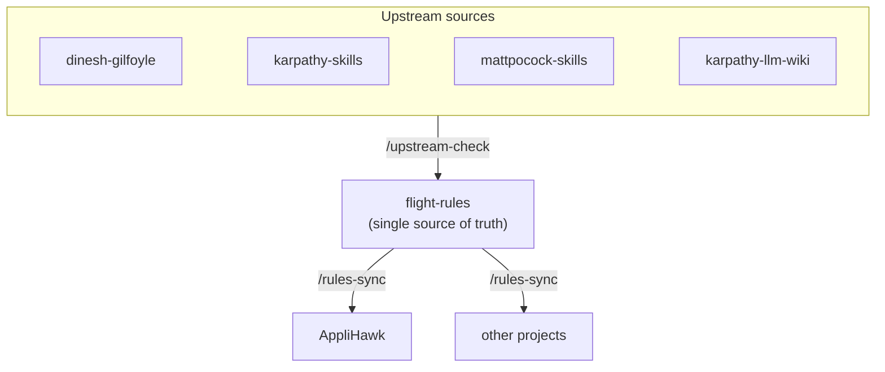

# flight-rules

[](.claude-plugin/plugin.json)
[](LICENSE)

Generic, project-agnostic engineering rules and AI workflows, distilled from real
projects (first: [AppliHawk](https://applihawk.com)). One source of truth — projects
consume this repo instead of maintaining drifting copies.

The name is borrowed from NASA's *flight rules* — the accumulated, written-down
procedures for every situation a mission has already encountered, so nobody improvises
a known problem twice.

Everything here is **plain Markdown and tool-agnostic**: the same files work with
Claude Code, Cursor, Codex, Copilot, Antigravity, or any assistant that reads Markdown
context. A thin Claude Code plugin wrapper is included so Claude installs the skills
natively.

See [CHANGELOG.md](CHANGELOG.md) for what changes between versions.

> **What the hooks are for.** They catch the workflow slip — a fix committed straight to
> a protected branch instead of on a worktree branch, a merge of work whose checks never
> ran, a `git rm` with a relative path after a `cd` that silently failed. They are
> guardrails, not a security boundary: anyone who means to get past them can, and an
> assistant given full control of a machine is beyond anything a repository of rules can
> reach. The design goal is to make the accidental path harder than the correct one, not
> to be unbypassable, and it assumes a competent developer: it catches what is easy to
> overlook, stops and says why when it cannot go on, and does not babysit. See
> [hooks/README.md](hooks/README.md#what-these-hooks-are--and-are-not).

## How it flows

One hub, two directions. Improvements from the sources this playbook adapts flow **in**
(reviewed via `/upstream-check`); the playbook flows **out** to every project (pulled and
reconciled via `/rules-sync`) — so nobody maintains a drifting copy.


```mermaid
flowchart TB
    subgraph sources["Upstream sources"]
        direction LR
        S1["dinesh-gilfoyle"] ~~~ S2["karpathy-skills"] ~~~ S4["mattpocock-skills"] ~~~ S5["karpathy-llm-wiki"]
    end
    sources -- "/upstream-check" --> FR["flight-rules<br/>(single source of truth)"]
    FR -- "/rules-sync" --> P1["AppliHawk"]
    FR -- "/rules-sync" --> P2["other projects"]
```

## Layout

```
MISSION.md What flight-rules is for — the questions every change to it answers
rules/     Always-on principles a project's CLAUDE.md / .cursorrules should point at
skills/    Invocable workflows — see the catalog below
hooks/     Enforcement templates — git merge-gate hooks + agent commit/secret guards
.claude-plugin/   Claude Code marketplace + plugin manifests
UPSTREAMS.md      Sources this playbook adapts from + last-synced refs (see /upstream-check)
```

The skills say what the workflow is; the hooks make it non-optional: `hooks/git/`
gates merges into protected branches and refuses a commit that stages a key,
`hooks/agent/` stops the assistant committing,
destroying or force-pushing a protected branch, or committing secrets. The agent guard
ships with the plugin; the git hooks are copied in once per clone. Both read
`.ai/flight-rules.conf` — see `hooks/README.md`.

## Rules

Always-on principles a project's rules entry point points at.

| Rule | Governs |
|---|---|
| [`engineering-principles`](rules/engineering-principles.md) | How to approach a change — scope discipline, verify before claiming done, suggest better ways, judge ideas on merit not authorship |
| [`git-worktree-workflow`](rules/git-worktree-workflow.md) | One change per branch via worktrees; never commit to a protected branch |
| [`multi-ai-setup`](rules/multi-ai-setup.md) | Conventions for running more than one AI assistant in a repo |

## Skills

Invocable workflows. In Claude Code they're slash commands; in any other tool they read as plain Markdown procedures.

| Skill | Does | Reach for it when |
|---|---|---|
| [`/dg`](skills/dg/SKILL.md) | Adversarial review — one persona defends, one tears it apart | Pressure-testing code, a design, or a decision |
| [`/diagnose`](skills/diagnose/SKILL.md) | Structured debugging — reproduce, minimise, fix, verify | A bug you can't one-shot |
| [`/feature-start`](skills/feature-start/SKILL.md) | Open a new branch as an isolated git worktree | Starting any unit of work |
| [`/pre-merge-check`](skills/pre-merge-check/SKILL.md) | Automated pre-merge checklist — tests, secrets, docs-match-the-change, and more; stamps a git note the merge-gate verifies | Before merging a branch |
| [`/pr-create`](skills/pr-create/SKILL.md) | Push the branch and open a GitHub PR with the checklist in the body | Ready to raise a PR |
| [`/commit`](skills/commit/SKILL.md) | Guarded commit — protected-branch, secret-scan, and test-coverage checks | Every commit |
| [`/docs-lint`](skills/docs-lint/SKILL.md) | Health-check living docs for drift, contradictions, and stale claims | Docs start to rot |
| [`/rules-sync`](skills/rules-sync/SKILL.md) | Pull the latest playbook and reconcile a project's local copies | After the playbook updates |
| [`/upstream-check`](skills/upstream-check/SKILL.md) | Check the sources this playbook adapts from for changes to fold in | Maintaining flight-rules itself |

## Consuming from a project

**Claude Code (skills, native):**
```
/plugin marketplace add mkb3nigma/flight-rules     # or the local clone path
/plugin install flight-rules@flight-rules
```

Then start a new session in the project. The first one shows a `flight-rules doctor`
message with the command that installs the git hooks (the merge gate and the secret
scan) into `.ai/hooks/`; run it and commit `.ai/hooks/`. A plugin cannot do this step
itself: the hooks are the project's own committed files, and Claude Code has no install
event for a plugin to act on. Every other clone needs them wired once, because git config is
per clone: its first session's doctor message prints the command (the plugin's
`install.sh`, which wires the committed hooks without replacing them). (The message needs `jq` or
`python3`; without either, doctor's findings reach only the assistant.) If the project already has
hooks of its own, the install leaves them in place: one in the folder it installs into
that it cannot recognise as flight-rules' (it carries no flight-rules marker and is no
release's exact copy) is refused rather than overwritten, and the install says how to
set it aside; and when git would stop reading hooks from `.git/hooks/` or a global
hooks folder, the install names the ones that stop running. Running them alongside
flight-rules' is [#111](https://github.com/mkb3nigma/flight-rules/issues/111).

**Updating:** `/plugin` → update, then start a new session — the session-start checks run
only when one starts. After `/reload-plugins` instead, your next prompt says the session
is on the new version and that a new session is what loads its rules and runs the checks. If a git hook is behind the new release, that session's doctor
message prints the sync command with `--stale-only`: it replaces only copies identical
to an older release, and leaves a hook you changed alone and names it. A project copy of
`install.sh` that is behind, differs while carrying flight-rules' marker, or cannot be read
is reported to the assistant only, not on screen: it guards nothing. To have the sync run on its own,
set `HOOK_SYNC=auto` in `.ai/flight-rules.conf` (see [Parameters](#parameters)). Each
release's
[CHANGELOG](CHANGELOG.md) entry starts with anything the update needs from you.

**Any AI tool (rules, by pointer):** add one line to the project's rules entry point
(CLAUDE.md, .cursorrules, `.ai/master-rules.md`, …):

> Generic engineering rules: read `~/Projects/flight-rules/rules/` (or the repo URL).
> Project rules extend and override them.

**Or just point your assistant at it.** No clone, plugin, or marketplace required — give
your assistant the repo link and ask it to incorporate the rules, or point your project's
rules file at the URL. The Claude Code plugin is a convenience wrapper, not a dependency;
a native plugin for other assistants (Cursor, Copilot, Antigravity, …) can follow if there's demand.
However you adopt it, keep the attribution — the MIT licence simply asks that the
copyright and licence notice travel with the content ([LICENSE](LICENSE),
[ATTRIBUTIONS.md](ATTRIBUTIONS.md)).

## Project-specific extensions

Never edit these files with project details. **Generic changes flow here; project
flavor stays in the project.** Two ways to consume, in order of preference:

1. **Plugin + `EXTENSIONS.md` (recommended).** Install the plugin and keep the
   playbook's skills as the single registered copy. A project extends a skill by
   creating `.ai/skills/<name>/EXTENSIONS.md` carrying only its delta: additional or
   replacement steps, project-specific rules, and `{PLACEHOLDER}` values other than
   the branch/path ones (those live in `.ai/flight-rules.conf`, below). Every skill
   checks for that file before executing and gives it precedence — projects get
   playbook updates automatically while their flavor stays local, and nothing is
   registered twice.
2. **Copy-in (legacy).** A project keeps a full local copy of a skill with a clearly
   marked `## <Project> Extensions` section at the bottom, or overrides a rule in its
   own rules file. Copies drift; reconcile with `/rules-sync`, which still understands
   this layout.

## Parameters

Skills refer to placeholders rather than hardcoding a project's setup. The branch
policy has **one home, `.ai/flight-rules.conf`**, the file the hooks read —
`PROTECTED_BRANCHES`, `PR_ONLY_BRANCHES`, `NOTE_GATED_BRANCHES`, `INTEGRATION_BRANCH`,
`WORKTREE_DIR`, `MERGE_NEEDS_INSTRUCTION` — so the skills and the enforcement never disagree about which
branches are protected. The rest lives in the skill's `EXTENSIONS.md`. The conf also
holds three `/dg` settings: `DG_COMIC` for the review's comic, `DG_COMIC_PR`, unset
by default, so no comic reaches a PR unless you set it, and `DG_WAIT_MINUTES`, how long
round 2 waits for each pre-review run and the dependency scan before treating it as
failed — see the
[Configuration table](hooks/README.md#configuration).

| Placeholder | Meaning | Example | Home |
|---|---|---|---|
| `{PROTECTED_BRANCHES}` | branches that never take direct commits (regex) | `^(main\|staging\|dev)$` | conf |
| `{PR_ONLY_BRANCHES}` | branches that move only through a reviewed PR — no local merges | `^main$` | conf |
| `{NOTE_GATED_BRANCHES}` | branches a merge into which needs a passing pre-merge-check note | `^(dev\|staging)$` | conf |
| `{INTEGRATION_BRANCH}` | where feature branches merge | `dev` | conf |
| `{WORKTREE_DIR}` | where feature worktrees live | `.ai/worktrees` | conf |
| `{TEST_COMMANDS}` | the project's suites | `pytest` / `npm run test:run` | `EXTENSIONS.md` |
| `{PLAYBOOK_PATH}`, `{LOCAL_RULES_DIRS}` | where `/rules-sync` finds the playbook and the project's local copies | `~/Projects/flight-rules`, `.ai/rules/` | `EXTENSIONS.md` |


## Design notes

- **Tool-agnostic by default.** Plain Markdown, so the same rules work in Claude Code,
  Cursor, Codex, or Copilot — no lock-in to one assistant.
- **Enforcement, not etiquette.** The workflows ship with git hooks that *block* the
  mistake — merging without a passing check, committing on a protected branch or with
  secrets staged — instead of trusting everyone to remember. This repo runs those hooks
  on itself, straight from `hooks/` with no copy in between, so the rules repo obeys
  its own rules and cannot drift from them (CI runs the hook suites on macOS and Linux).
- **One source of truth.** Projects consume the playbook and reconcile with `/rules-sync`
  rather than copy-pasting rules that silently drift apart.
- **Provenance as a system.** Each adaptation is pinned to an upstream ref and re-checked
  with `/upstream-check`, so credited work stays current and honestly attributed.

## Credits & license

MIT for original content (see `LICENSE`). Several pieces adapt other people's work and
carry their upstream licenses — notably the `dg` skill (from
[v1r3n/dinesh-gilfoyle](https://github.com/v1r3n/dinesh-gilfoyle), Apache-2.0) and the
engineering principles (from
[multica-ai/andrej-karpathy-skills](https://github.com/multica-ai/andrej-karpathy-skills),
MIT, after Andrej Karpathy's observations).

Provenance is tracked as a system, not a footnote: every adaptation is credited with its
modifications in [ATTRIBUTIONS.md](ATTRIBUTIONS.md), and each source's last-reviewed ref
is pinned in [UPSTREAMS.md](UPSTREAMS.md) so `/upstream-check` can tell when an upstream
has moved and something is worth folding back in.
